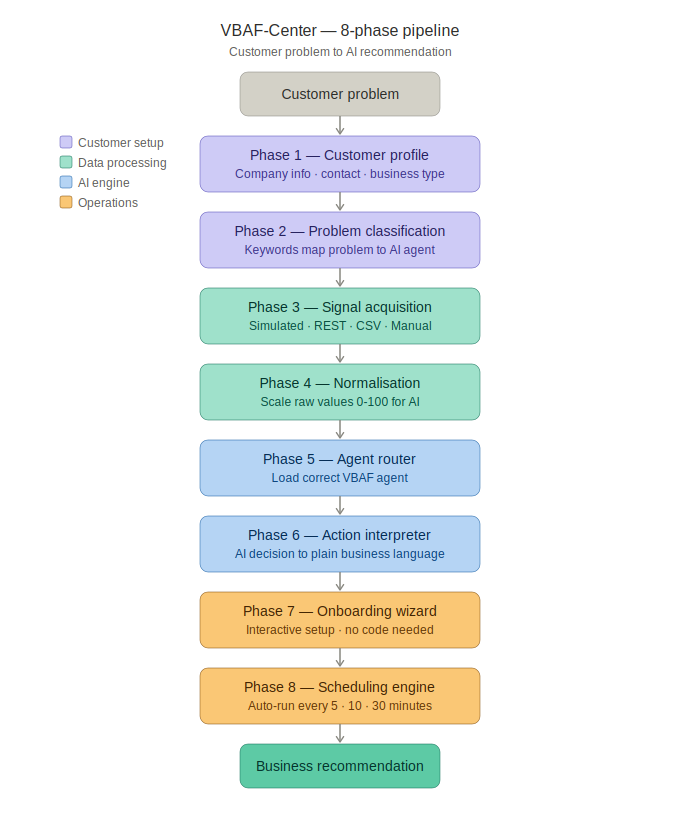

# VBAF-Center � Welcome Center

> **v1.0.0** � PowerShell 5.1 � Enterprise AI Gateway � Built on VBAF v4.0.0

[](LICENSE)
[](https://github.com/PowerShell/PowerShell)
[](https://www.powershellgallery.com/packages/VBAF)

---

## What is VBAF-Center?

VBAF-Center is the commercial gateway between your business systems
and the VBAF AI agent engine. It receives your live data, normalises it,
routes it to the right trained agent, and returns the action in your
own business language.

**VBAF trains the doctors. VBAF-Center runs the hospital.**

---

## The Medical Analogy
```
Your business data  = Patient arriving at hospital
VBAF-Center        = Triage nurse
VBAF Agent         = Specialist doctor
Your system        = Pharmacy filling the prescription
```

---

## How It Works
```
Your systems (GPS, TMS, ERP, SAP...)
         |
         | live signals (any format)
         v
+---------------------------------+
�       VBAF-Center               �
�                                 �
�  Phase 1: WHO are you?          �
�  Phase 2: WHAT is the problem?  �
�  Phase 3: WHERE is your data?   �
�  Phase 4: Normalise to 0.0-1.0  �
�  Phase 5: Route to right agent  �
�  Phase 6: Interpret action      �
�  Phase 7: Onboarding UI         �
�  Phase 8: Schedule checks       �
+---------------------------------+
         |
         | action in YOUR language
         v
Your systems act:
"Move truck DK-4471 to job #2847"
```

---

## Architecture



---

## Quick Start
```powershell
# Install VBAF engine first
Install-Module VBAF -Scope CurrentUser

# Install VBAF-Center
Install-Module VBAF-Center -Scope CurrentUser

# Load everything
. .\VBAF-Center\VBAF.Center.LoadAll.ps1

# Onboard your first customer (interactive wizard)
Start-VBAFCenterOnboarding

# Run the pipeline
Invoke-VBAFCenterRun -CustomerID "YourCustomerID"
```

---

## The 8 Phases

| Phase | Name | What it does |
|-------|------|-------------|
| 1 | Customer Profile | WHO are you? |
| 2 | Problem Classification | WHAT is your emergency? |
| 3 | Signal Acquisition | WHERE is your data? REST/WMI/CSV/Manual |
| 4 | Normalisation | Convert raw figures to 0.0-1.0 |
| 5 | Agent Router | Send to the right VBAF doctor |
| 6 | Action Interpreter | Translate action to business command |
| 7 | Customer Onboarding UI | Interactive setup wizard � set once, run forever |
| 8 | Scheduling Engine | How often to check � configurable per customer |

---

## NordLogistik � Proof of Concept
```
Problem  : Trucks idle 30%, late deliveries, lost biggest client
Signals  : Fleet idle rate + Delivery urgency
Agent    : VBAF FleetDispatch (Phase 28)
Result   : +97% improvement over random dispatcher

Action 0 : Monitor   � Fleet healthy, watch and wait
Action 1 : Reassign  � Move idle truck to pending delivery
Action 2 : Reroute   � Switch to faster routes
Action 3 : Escalate  � Emergency, deploy all trucks
```

---

## Available VBAF Agents

| Domain | Agent | Phase |
|--------|-------|-------|
| IT Infrastructure | SelfHealing | 14 |
| IT Dashboard | Dashboard | 15 |
| Cloud Management | CloudBridge | 17 |
| Anomaly Detection | AnomalyDetector | 18 |
| Capacity Planning | CapacityPlanner | 19 |
| Incident Response | IncidentResponder | 20 |
| Compliance | ComplianceReporter | 21 |
| Security | UserBehaviorAnalytics | 22 |
| Patch Management | PatchIntelligence | 23 |
| Backup | BackupOptimizer | 24 |
| Energy | EnergyOptimizer | 25 |
| Multi-site | MultiSiteCoordinator | 26 |
| Full Automation | AutoPilot | 27 |
| Fleet Dispatch | FleetDispatch | 28 |

---

## Business Model
```
VBAF         � free, open source, PSGallery
VBAF-Center  � commercial service

Onboarding   : one-time setup fee
Running      : monthly subscription per customer
Custom pillars: project rate
```

---

## Relationship to VBAF

VBAF-Center uses VBAF as its AI engine.
VBAF does not change � it is the stable foundation.
VBAF-Center is the commercial layer on top.
```
Install-Module VBAF          # the doctors
Install-Module VBAF-Center   # the hospital
```

---

## Requirements

- Windows 10 or 11
- PowerShell 5.1
- VBAF v4.0.0 (`Install-Module VBAF`)

---

## License

MIT License � see [LICENSE](LICENSE) for details.

---

## Author

**Henning** � Roskilde, Denmark 🇩🇰
Built with Claude (Anthropic) � PowerShell ISE � PS 5.1

*"Tell us your problem. We know the right doctor."*


